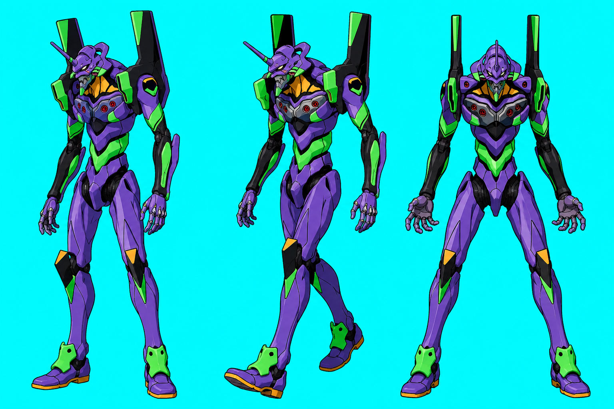

# PetEVA: EVA / Neon Genesis Evangelion Custom Desktop Pet



Unit-01 风格桌面宠物方向草图 / Draft visual preview of the
Unit-01-style desktop pet direction.

**中文简介**
PetEVA 是一个以 **EVA / 新世纪福音战士** 为主题的非官方自定义桌面宠物项目。
它面向喜欢 Evangelion、桌面宠物、自定义 Codex 工作空间、本地优先工具和
轻量陪伴型 UI 的用户，提供 EVA 初号机、零号机、二号机等机体风格的宠物素材
与本地运行体验。项目支持 Codex Desktop 自定义 Pets 素材包，也提供轻量
macOS-first 本地 runtime，让机体可以在桌面上待机、行走、奔跑、跳跃，并显示
可配置的喝水和活动提醒。

**English Summary**
PetEVA is a fan-made **EVA / Neon Genesis Evangelion** custom desktop pet
project for users who enjoy Evangelion, desktop companions, custom Codex
workspaces, local-first tools, and lightweight ambient UI. It provides EVA
Unit-style pet assets for Unit-01 and Unit-02, plus a local runtime path.
The project includes Codex Desktop custom Pets compatibility plus a lightweight
macOS-first runtime where the pet can idle, walk, run, jump, and show
configurable hydration and activity reminders.

PetEVA is not an official Evangelion project and does not ship official logos,
official screenshots, official audio, or copied production artwork.

---

# Runtime Guide

PetEVA currently supports two ways to use the pet:

- Recommended: run the lightweight desktop pet process from this project.
- Optional compatibility: copy a Codex custom pet package into Codex Desktop's
  built-in pet folder.

The lightweight runtime has richer behavior: transparent desktop window,
random movement, walk/run/crawl/jump frames, water reminders, and activity
reminders. The Codex built-in pet path only uses `pet.json` plus
`spritesheet.webp`, so it is simpler and does not run the PetEVA movement
runtime.

Currently packaged units:

- `eva-01`
- `eva-02`

---

## Requirements And Common Issues

### English

Use the project wrapper scripts whenever possible:

```bash
scripts/peteva-runtime ...
scripts/peteva-python ...
```

`scripts/peteva-python` first tries the Codex bundled Python runtime, then
falls back to `$PYTHON` or `python3`. The bundled Codex runtime usually already
has Pillow installed. A normal system Python may not.

Required tools:

- macOS is recommended for the lightweight desktop runtime.
- Windows is not officially supported yet. The image assets are portable, but
  the current runtime is macOS-first; Windows would need a PowerShell launcher
  plus validation of the Tk fallback or a native Windows window backend.
- Xcode Command Line Tools, or another Swift toolchain, are required for
  `scripts/peteva-runtime run --backend macos`.
- Python 3 is required for the control CLI and asset tools.
- Pillow is required for tests, spritesheet validation/build scripts, and the
  Tk fallback backend. The macOS backend usually does not need Pillow at runtime
  unless it falls back to Tk.
- `tmux` is optional and is only used for background runs.

If a command fails with `ModuleNotFoundError: No module named 'PIL'` or
`Pillow is not available in this Python runtime`, use one of these fixes:

```bash
python3 -m pip install Pillow
```

or use an isolated environment:

```bash
python3 -m venv .venv
. .venv/bin/activate
python -m pip install Pillow
PYTHON="$PWD/.venv/bin/python" scripts/peteva-runtime run --backend macos
```

For tests, prefer the wrapper:

```bash
scripts/peteva-python -m unittest discover -s tests -v
```

Other common issues:

- `PetEVA runtime stopped: local switch disabled` means the pet is off. Run
  `scripts/peteva-runtime enable --unit eva-01` or `eva-02` first.
- `swiftc` not found means the macOS backend cannot be built. Install Xcode
  Command Line Tools with `xcode-select --install`, or try `--backend tk`.
- `Tkinter is not available` means the Tk fallback cannot run in that Python.
  Use the macOS backend on macOS, or install a Python build that includes Tk.
- `spritesheet not found` or missing motion frames usually means the selected
  unit does not have a complete asset package. `eva-01` and `eva-02` are the current packaged units.
- Codex built-in Pets only use `pet.json` and `spritesheet.webp`. They do not
  run PetEVA's movement runtime, reminders, or local switch file.

### 中文

建议始终通过项目自带 wrapper 运行：

```bash
scripts/peteva-runtime ...
scripts/peteva-python ...
```

`scripts/peteva-python` 会优先使用 Codex bundled Python runtime，然后才退回
`$PYTHON` 或 `python3`。Codex bundled runtime 通常已经包含 Pillow；普通系统
Python 不一定包含。

使用要求：

- 轻量桌面宠物推荐在 macOS 上运行。
- Windows 目前尚未正式支持。图片素材本身是跨平台的，但当前 runtime 以
  macOS 为主；Windows 需要补充 PowerShell 启动脚本，并验证 Tk 备用后端
  或实现 Windows 原生窗口后端。
- `scripts/peteva-runtime run --backend macos` 需要 Xcode Command Line Tools
  或其他可用的 Swift 工具链。
- 控制 CLI 和素材工具需要 Python 3。
- 测试、spritesheet 构建/校验脚本、Tk 备用后端需要 Pillow。macOS 后端正常
  运行时通常不需要 Pillow，除非它失败后回退到 Tk。
- `tmux` 不是必须的，只用于后台运行。

如果遇到 `ModuleNotFoundError: No module named 'PIL'` 或
`Pillow is not available in this Python runtime`，说明当前 Python 缺 Pillow。
可以安装：

```bash
python3 -m pip install Pillow
```

也可以使用独立虚拟环境：

```bash
python3 -m venv .venv
. .venv/bin/activate
python -m pip install Pillow
PYTHON="$PWD/.venv/bin/python" scripts/peteva-runtime run --backend macos
```

跑测试时建议使用 wrapper：

```bash
scripts/peteva-python -m unittest discover -s tests -v
```

其他常见问题：

- `PetEVA runtime stopped: local switch disabled` 表示本地开关是关闭状态。
  先运行 `scripts/peteva-runtime enable --unit eva-01` 或 `eva-02`。
- `swiftc` 找不到表示 macOS 后端无法构建。可运行 `xcode-select --install`
  安装 Xcode Command Line Tools，或尝试 `--backend tk`。
- `Tkinter is not available` 表示当前 Python 无法运行 Tk 备用后端。macOS 上
  优先使用 macOS 后端，或换一个包含 Tk 的 Python。
- `spritesheet not found` 或 motion frames 缺失，通常表示选择的机体素材包
  不完整。当前已打包主体是 `eva-01` 和 `eva-02`。
- Codex 内置 Pets 只读取 `pet.json` 和 `spritesheet.webp`，不会运行
  PetEVA 的移动 runtime、定时提醒或本地开关逻辑。

### 日本語

できるだけプロジェクト付属の wrapper を使ってください。

```bash
scripts/peteva-runtime ...
scripts/peteva-python ...
```

`scripts/peteva-python` は、まず Codex bundled Python runtime を使い、
なければ `$PYTHON` または `python3` にフォールバックします。Codex bundled
runtime には通常 Pillow が入っていますが、通常の system Python には入って
いない場合があります。

必要な環境:

- 軽量デスクトップ runtime は macOS 推奨です。
- Windows はまだ正式にはサポートしていません。画像アセット自体は
  ポータブルですが、現在の runtime は macOS-first です。Windows 対応には
  PowerShell launcher の追加と、Tk fallback または Windows native window
  backend の検証が必要です。
- `scripts/peteva-runtime run --backend macos` には Xcode Command Line Tools
  または Swift toolchain が必要です。
- 制御 CLI とアセット用ツールには Python 3 が必要です。
- テスト、spritesheet の build/validate、Tk fallback backend には Pillow が
  必要です。macOS backend は通常、実行時には Pillow を必要としませんが、
  Tk にフォールバックする場合は必要です。
- `tmux` は任意です。バックグラウンド起動にだけ使います。

`ModuleNotFoundError: No module named 'PIL'` または
`Pillow is not available in this Python runtime` が出た場合は、現在の
Python に Pillow がありません。次のどちらかで対応できます。

```bash
python3 -m pip install Pillow
```

または仮想環境を使います。

```bash
python3 -m venv .venv
. .venv/bin/activate
python -m pip install Pillow
PYTHON="$PWD/.venv/bin/python" scripts/peteva-runtime run --backend macos
```

テストは wrapper 経由を推奨します。

```bash
scripts/peteva-python -m unittest discover -s tests -v
```

よくある問題:

- `PetEVA runtime stopped: local switch disabled` は Pet が無効状態という
  意味です。先に `scripts/peteva-runtime enable --unit eva-01` または
  `eva-02` を実行してください。
- `swiftc` が見つからない場合、macOS backend を build できません。
  `xcode-select --install` で Xcode Command Line Tools を入れるか、
  `--backend tk` を試してください。
- `Tkinter is not available` は、その Python で Tk fallback を実行できない
  という意味です。macOS では macOS backend を優先するか、Tk 付きの Python
  を使ってください。
- `spritesheet not found` や motion frames の不足は、選択した機体の asset
  package が未完成である可能性があります。現在パッケージ済みの主体は `eva-01` と `eva-02` です。
- Codex 内蔵 Pets は `pet.json` と `spritesheet.webp` だけを使います。
  PetEVA の movement runtime、reminder、local switch は動きません。

---

## English

### Run The Lightweight Pet

From the project root:

```bash
cd "/path/to/PetEVA"
scripts/peteva-runtime enable --unit eva-01
scripts/peteva-runtime run --backend macos
```

Use `--backend macos` on macOS for the transparent, borderless desktop window.
Use `--backend tk` only as a fallback.

To run it in the background with tmux:

```bash
cd "/path/to/PetEVA"
tmux new-session -d -s peteva-runtime 'cd "/path/to/PetEVA" && scripts/peteva-runtime run --backend macos'
```

Check the current local switch state:

```bash
scripts/peteva-runtime status
```

Stop the pet:

```bash
scripts/peteva-runtime disable
tmux kill-session -t peteva-runtime
```

`disable` updates the local switch file. The tmux command stops a background
runtime session if one is running.

### Switch EVA Units

Set the desired unit:

```bash
scripts/peteva-runtime enable --unit eva-01
scripts/peteva-runtime enable --unit eva-02
```

If the pet is already running, restart the runtime after switching units. The
current runtime reads the unit at process start.

```bash
tmux kill-session -t peteva-runtime 2>/dev/null || true
tmux new-session -d -s peteva-runtime 'cd "/path/to/PetEVA" && scripts/peteva-runtime run --backend macos'
```

The default unit lives in `config/default.yaml`:

```yaml
runtime:
  pet:
    activeUnit: eva-01
```

Use the config file when you want to change the long-term default. Use
`enable --unit ...` when you only want to switch the local runtime state.

### Configure Reminders

Reminder timing, text, and optional display duration live in
`config/default.yaml`:

```yaml
runtime:
  reminders:
    defaultDisplaySeconds: 55
    water:
      enabled: true
      intervalMinutes: 20
      message: 该喝水了。
      displaySeconds: 55
    activity:
      enabled: true
      intervalMinutes: 30
      message: 起来活动一下。
```

`displaySeconds` can be omitted on a single reminder. If omitted, the runtime
uses `defaultDisplaySeconds`. Display time is capped at 60 seconds.

### Codex Built-In Pet Compatibility

Codex Desktop custom pets use this folder format:

```text
~/.codex/pets/<pet-id>/
  pet.json
  spritesheet.webp
```

PetEVA already stores compatible packages under:

```text
assets/codex-pets/eva-01/
assets/codex-pets/eva-02/
```

Install or refresh EVA01 for Codex built-in Pets:

```bash
mkdir -p "$HOME/.codex/pets/eva-01"
rsync -a assets/codex-pets/eva-01/pet.json assets/codex-pets/eva-01/spritesheet.webp "$HOME/.codex/pets/eva-01/"
```

Install or refresh EVA02:

```bash
mkdir -p "$HOME/.codex/pets/eva-02"
rsync -a assets/codex-pets/eva-02/pet.json assets/codex-pets/eva-02/spritesheet.webp "$HOME/.codex/pets/eva-02/"
```

Then open Codex Desktop:

```text
Settings > Appearance > Pets > Refresh
```

Select the custom pet, for example `custom:eva-01` or `custom:eva-02`.

This is similar to a `hatch-pet` result because Codex only needs
`pet.json` and `spritesheet.webp`. You do not need to run hatch again unless
you want to create a new pet from scratch.

---

## 中文

### 运行轻量桌面宠物

在项目根目录运行：

```bash
cd "/path/to/PetEVA"
scripts/peteva-runtime enable --unit eva-01
scripts/peteva-runtime run --backend macos
```

macOS 上建议使用 `--backend macos`，它会启动透明、无边框的桌面宠物窗口。
`--backend tk` 只是备用方案。

如果希望后台运行，可以用 tmux：

```bash
cd "/path/to/PetEVA"
tmux new-session -d -s peteva-runtime 'cd "/path/to/PetEVA" && scripts/peteva-runtime run --backend macos'
```

查看当前本地开关状态：

```bash
scripts/peteva-runtime status
```

停止宠物：

```bash
scripts/peteva-runtime disable
tmux kill-session -t peteva-runtime
```

`disable` 会关闭本地开关文件；如果宠物是用 tmux 后台启动的，再用
`tmux kill-session` 结束后台进程。

### 切换 EVA 主体

切换到 EVA01 或 EVA02：

```bash
scripts/peteva-runtime enable --unit eva-01
scripts/peteva-runtime enable --unit eva-02
```

如果宠物已经在运行，切换后需要重启 runtime。当前版本会在进程启动时读取
主体，不会在运行中热切换素材。

```bash
tmux kill-session -t peteva-runtime 2>/dev/null || true
tmux new-session -d -s peteva-runtime 'cd "/path/to/PetEVA" && scripts/peteva-runtime run --backend macos'
```

长期默认主体在 `config/default.yaml` 中配置：

```yaml
runtime:
  pet:
    activeUnit: eva-01
```

想长期默认用某台机体，就改配置文件。只是临时切换时，用
`enable --unit ...` 即可。

### 配置定时提醒

提醒间隔、提醒文字、可选显示时长都在 `config/default.yaml` 中：

```yaml
runtime:
  reminders:
    defaultDisplaySeconds: 55
    water:
      enabled: true
      intervalMinutes: 20
      message: 该喝水了。
      displaySeconds: 55
    activity:
      enabled: true
      intervalMinutes: 30
      message: 起来活动一下。
```

单个提醒可以不写 `displaySeconds`。如果不写，会使用
`defaultDisplaySeconds`。显示时长会被限制在 60 秒以内。

### 兼容 Codex 内置 Pets

Codex Desktop 的自定义 pet 使用如下结构：

```text
~/.codex/pets/<pet-id>/
  pet.json
  spritesheet.webp
```

PetEVA 项目内已经准备了兼容包：

```text
assets/codex-pets/eva-01/
assets/codex-pets/eva-02/
```

安装或刷新 EVA01 到 Codex 内置 Pets：

```bash
mkdir -p "$HOME/.codex/pets/eva-01"
rsync -a assets/codex-pets/eva-01/pet.json assets/codex-pets/eva-01/spritesheet.webp "$HOME/.codex/pets/eva-01/"
```

安装或刷新 EVA02：

```bash
mkdir -p "$HOME/.codex/pets/eva-02"
rsync -a assets/codex-pets/eva-02/pet.json assets/codex-pets/eva-02/spritesheet.webp "$HOME/.codex/pets/eva-02/"
```

然后在 Codex Desktop 中：

```text
Settings > Appearance > Pets > Refresh
```

选择对应的自定义宠物，例如 `custom:eva-01` 或 `custom:eva-02`。

这个方式和 `hatch-pet` 生成出来的包类似，因为 Codex 内置 Pets 只需要
`pet.json` 和 `spritesheet.webp`。除非你要从零创建一只全新的宠物，否则
不需要重新运行 hatch。

---

## 日本語

### 軽量デスクトップ Pet を起動する

プロジェクトのルートで実行します。

```bash
cd "/path/to/PetEVA"
scripts/peteva-runtime enable --unit eva-01
scripts/peteva-runtime run --backend macos
```

macOS では `--backend macos` を推奨します。透明で枠のないデスクトップ
Pet ウィンドウとして動きます。`--backend tk` は予備のバックエンドです。

tmux でバックグラウンド起動する場合:

```bash
cd "/path/to/PetEVA"
tmux new-session -d -s peteva-runtime 'cd "/path/to/PetEVA" && scripts/peteva-runtime run --backend macos'
```

現在のローカルスイッチ状態を確認:

```bash
scripts/peteva-runtime status
```

停止:

```bash
scripts/peteva-runtime disable
tmux kill-session -t peteva-runtime
```

`disable` はローカルスイッチファイルを無効にします。tmux で起動している
場合は、`tmux kill-session` でバックグラウンドプロセスも停止します。

### EVA 機体を切り替える

EVA01 または EVA02 に切り替えます。

```bash
scripts/peteva-runtime enable --unit eva-01
scripts/peteva-runtime enable --unit eva-02
```

Pet がすでに動作中の場合は、切り替え後に runtime を再起動してください。
現在の runtime は、起動時に機体を読み込みます。

```bash
tmux kill-session -t peteva-runtime 2>/dev/null || true
tmux new-session -d -s peteva-runtime 'cd "/path/to/PetEVA" && scripts/peteva-runtime run --backend macos'
```

長期的なデフォルト機体は `config/default.yaml` で設定します。

```yaml
runtime:
  pet:
    activeUnit: eva-01
```

普段使う機体を変える場合は設定ファイルを編集します。一時的に切り替える
だけなら、`enable --unit ...` を使ってください。

### リマインダーを設定する

リマインダーの間隔、表示テキスト、任意の表示時間は
`config/default.yaml` で設定します。

```yaml
runtime:
  reminders:
    defaultDisplaySeconds: 55
    water:
      enabled: true
      intervalMinutes: 20
      message: 该喝水了。
      displaySeconds: 55
    activity:
      enabled: true
      intervalMinutes: 30
      message: 起来活动一下。
```

個別のリマインダーでは `displaySeconds` を省略できます。省略した場合は
`defaultDisplaySeconds` が使われます。表示時間は最大 60 秒に制限されます。

### Codex 内蔵 Pets との互換性

Codex Desktop のカスタム Pet は、次の形式のフォルダを読み込みます。

```text
~/.codex/pets/<pet-id>/
  pet.json
  spritesheet.webp
```

PetEVA には、すでに互換パッケージがあります。

```text
assets/codex-pets/eva-01/
assets/codex-pets/eva-02/
```

EVA01 を Codex 内蔵 Pets にインストール、または更新:

```bash
mkdir -p "$HOME/.codex/pets/eva-01"
rsync -a assets/codex-pets/eva-01/pet.json assets/codex-pets/eva-01/spritesheet.webp "$HOME/.codex/pets/eva-01/"
```

EVA02 をインストール、または更新:

```bash
mkdir -p "$HOME/.codex/pets/eva-02"
rsync -a assets/codex-pets/eva-02/pet.json assets/codex-pets/eva-02/spritesheet.webp "$HOME/.codex/pets/eva-02/"
```

その後、Codex Desktop で次を開きます。

```text
Settings > Appearance > Pets > Refresh
```

`custom:eva-01` または `custom:eva-02` を選択します。

この形式は `hatch-pet` で作られるパッケージに近いです。Codex 内蔵 Pets
は `pet.json` と `spritesheet.webp` だけを使います。新しい Pet をゼロから
作る場合を除き、hatch を再実行する必要はありません。
